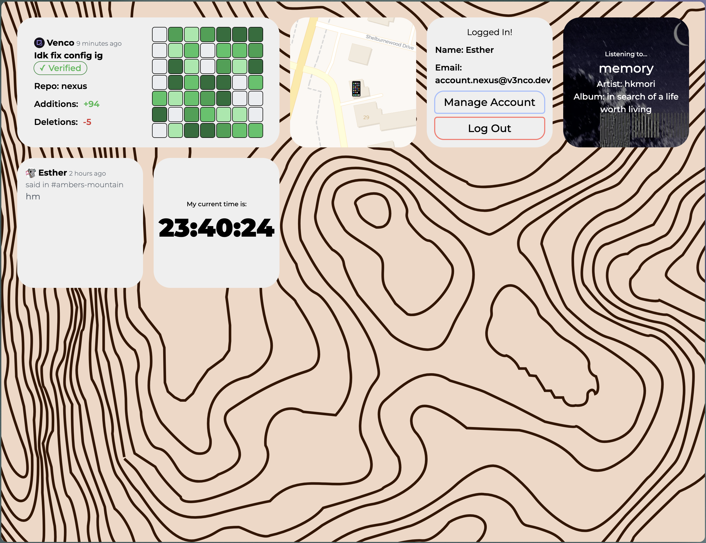

# Nexus

## What's nexus ?
This project was made for [Hackclub Midnight](https://midnight.hackclub.com)!
The point of it is that people can see what I've been up to lately, all on one webpage!
If data gets a little *too* intrusive; I also set up an account and permission system so that the data isn't available to the whole world instantly!

## What's available in nexus ?
Well I can give you a roadmap of what's done and what I was (originally) planning to do; the ones who arent done aren't guarenteed to come in the future, but if you want to see an integration happen, feel free to [Make a PR!](https://github.com/V3NCO/nexus/pulls)

- [x] Live location - Behind login and for both devices
- [x] Currently playing music
- [x] The current time for where I am
- [x] Latest git commit + activity
- [x] Last slack public channel message
- [ ] Phone status:
  - Battery
  - DND
  - Connected
  - Locked
  - Hotspot on/off
  - Other stuff
- [ ] Laptop status:
  - Battery
  - DND
  - Connected
  - Active
  - Angle where its open displayed with a 3d model would be nice?
- [ ] Live age counter
- [ ] Current timetable/Calendar
- [ ] Heartrate?
- [ ] HwF status?
- [ ] Flipper Zero?
- [ ] Steps/Until 10K?
- [ ] Last transaction?
- [ ] Eeping or not?

## Screenshot


## Requirements
You need the following to spin up a nexus instance:
- Docker
- A github account
- A Hack Club account
- A Home assistant instance with at least one mobile app connected
- A LastFM account
- A Discord account
- An account on the Hack Club Slack

> [!IMPORTANT]
> This list may get longer in future updates as I add more integrations, be careful when updating
> The Home assistant integration may need more sensors in the future
> Be ready to get in the code and disable stuff manually if you can't keep up

## Deploying
Okay this one is a bit tricky heres a step by step guide

### Filling .env/Getting API keys
Copy .env.example and name that copy .env; we're going to fill each individual field in that file with the following info:
#### Github
1. Go to your user settings, then go under Developer Settings > Personal access tokens > Fine-grained tokens
2. Create a new token, give it any name you want, put the expiration that fits your needs
3. Choose the repository option you want nexus to see
4. For the permissions:
  - Accounts:
    - Events: Read-only
  - Repository (if available):
    - Contents: Read-only
5. Click Generate token, copy it and paste it for `GITHUB_TOKEN=` in `.env`

#### Better Auth
1. Run `openssl rand -base64 32` in a terminal
2. Copy the output in `BETTER_AUTH_SECRET=` in `.env`
3. Set `BETTER_AUTH_URL=` to the base URL of your site; if users access the website via `https://nexus.v3nco.dev` for example, set it to `BETTER_AUTH_URL=https://nexus.v3nco.dev`

#### Hackclub Auth
1. Go to https://auth.hackclub.com/identity/edit and enable developer mode
2. Go to the Developer tab and click "app me up!"
3. Set any name, put the Redirect URI to `[BETTER_AUTH_URL]/api/auth/oauth2/callback/hackclub` replacing `[BETTER_AUTH_URL]` with the value you set earlier, in my case it would look like this: `https://nexus.v3nco.dev/api/auth/oauth2/callback/hackclub`
4. Set the following scopes:
  - openid
  - profile
  - email
  - slack_id
5. Put the client ID under `HACKCLUB_AUTH_CLIENT_ID=` and the client secret under `HACKCLUB_AUTH_CLIENT_SECRET=`

#### Home Assistant
1. Enable the following sensors on your mobile app
- Location sensors
  - Background location
  - Location Zone
  - Single accurate location
- Time zone sensor
  - Current time zone
2. Go in your home assistant instance, click on your user
3. Go in the security tab
4. Create a Long-lived access token
5. Copy the token in `HASS_TOKEN=`
6. Copy your home assistant URL (the server needs to be able to access it) in `HASS_TOKEN=`

#### Discord
1. Go to https://discord.com/developers/applications, create a new app
2. In that new app go to the OAuth2 tab
3. Add the redirect link `[BETTER_AUTH_URL]/api/auth/callback/discord` by replacing `[BETTER_AUTH_URL]` with the actual value
4. Copy the client ID to `DISCORD_AUTH_CLIENT_ID=`
5. Reset and copy the client Secret to `DISCORD_AUTH_CLIENT_SECRET=`

#### LastFM
1. Go to https://www.last.fm/api/account/create, Put your email and the application name and click create
2. Copy the API Key to `LASTFM_KEY=`
3. Copy the Shared Secret to `LASTFM_SHARED_SECRET=`

#### Slack
1. Go to https://api.slack.com/apps
2. Create New app from manifest, modify the redirect url to be yours (doesn't really matter anyways)
```json
{
    "display_information": {
        "name": "Nexus"
    },
    "oauth_config": {
        "redirect_urls": [
            "https://nexus.v3nco.dev"
        ],
        "scopes": {
            "user": [
                "search:read",
                "users:read",
                "users.profile:read"
            ]
        }
    },
    "settings": {
        "org_deploy_enabled": false,
        "socket_mode_enabled": false,
        "token_rotation_enabled": false
    }
}
```
3. Install to hack club and copy the token to `SLACK_TOKEN=`
